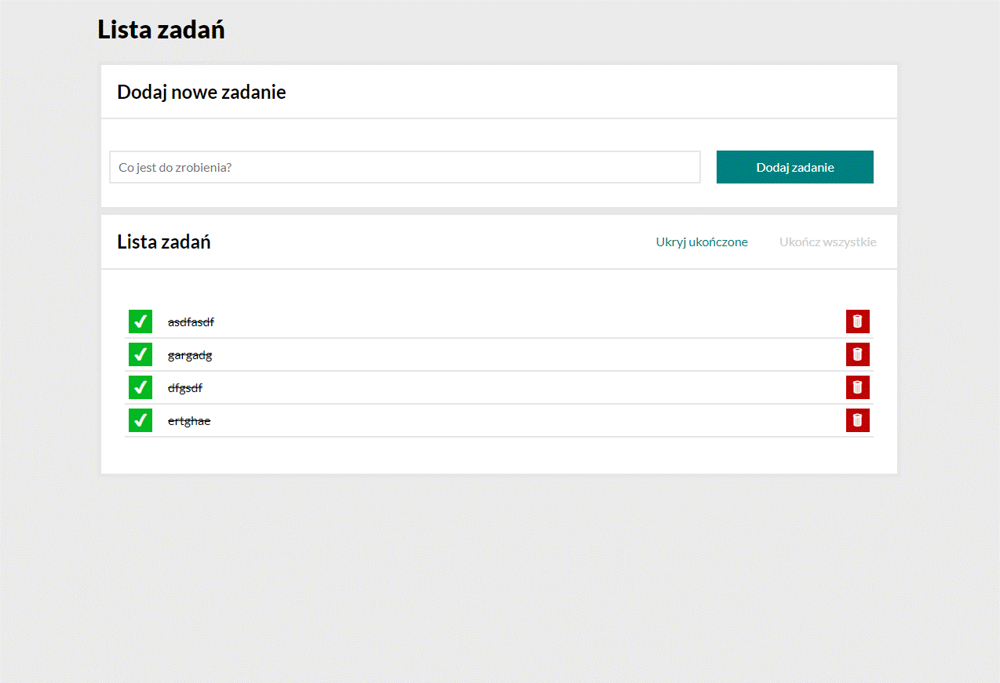

# Tasks List

### Demo:
[Demo](https://p27wasylik.github.io/TasksList/)

### Structur based on

- BEM
- camelCase
- function

### List based on

- input and button for add list items
- unordered list with delete button and status change button

### Describe

The webapp is created for lerning purpose, where you can add a to do list item and check it or uncheck it as done or undone. App will refresh automaticly whithout refreshing page.
There are button for mark all at once as done and other for hide or show tasks that are completed.

> **Note** The course is available on their official webside [Youcode](https://youcode.pl)

Purpose of this website is lern how to code with JavaScript.